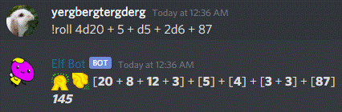
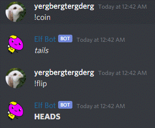

# Elf Bot

[Invite Elf Bot to your discord server!](https://discord.com/oauth2/authorize?client_id=734224877195755600&scope=bot)

A discord bot to help you:
* Roll dice!



* Flip coins!



It's not the best bot for rolling dice or playing Dungeons and Dragons, but it's a fun bot to work on and bring to life!


## Other Neat Features!

* Custom status messages!


## Setting it Up Yourself

Elf Bot was made with `nodejs` and uses the `discordjs` package. 

It's recommended to have `git`, `nodejs`, and `npm` installed.

### Some Terminals you can run on Windows
* Powershell
* Cmd.exe
* Windows Subsystem for Linux
* Git Bash
* Cygwin
### Some Terminals you can run on MacOS
* Terminal (Cmd+Space to open search bar, and search for "Terminal")
* iTerm2
### Some Terminals you can run on Linux
* Whichever terminal your Linux Distro comes with. Some distros have a shortcut to let you open a terminal with `Ctrl + Alt + t`

In a terminal, run these commands:
```bash
git clone https://github.com/colonendbracket/elfbot.git
cd elfbot   # move into the folder you just cloned
npm install # installs the dependencies for this node project
cp bot_config.json.template bot_config.json
# make sure to edit bot_config.json to include a valid discord bot token
node .      # runs Elf Bot
```
## Acquiring a Discord Bot Token

Access the Discord Developer Portal to make your own Discord Bot!
https://discord.com/developers/applications
## Special Thanks
Thanks to Jack for relentlessly trying to break Elf Bot and even causing crashes along the way.
